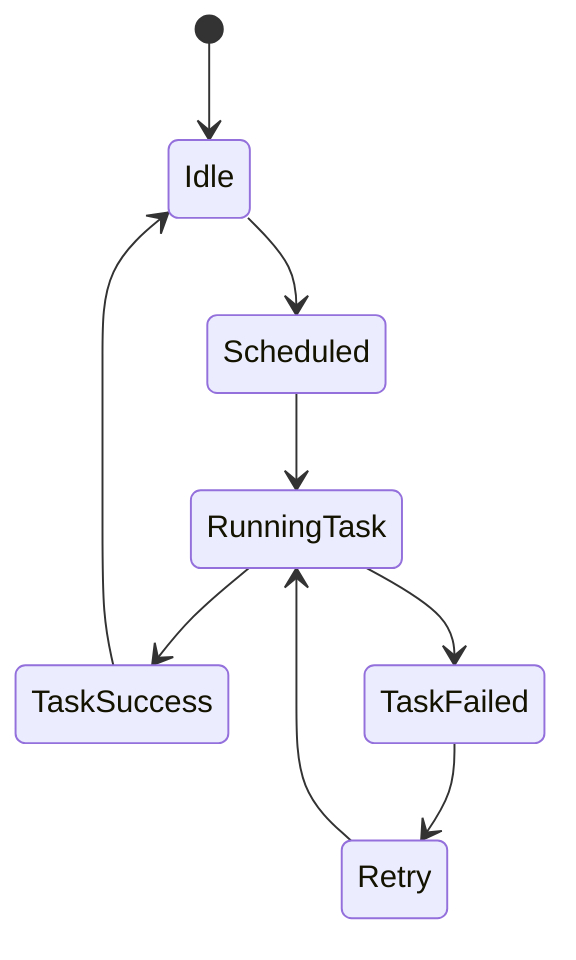

# Celery and Beat

Celery is used for asynchronous task execution, while Celery Beat schedules periodic tasks.

## Responsibilities

* Execute background jobs
* Retry failed commands
* Perform maintenance tasks
* Schedule recurring operations

## State Diagram

## Notes

* Tasks must be idempotent.
* Use cases should be reused inside tasks.
* Celery workers can be scaled horizontally.
