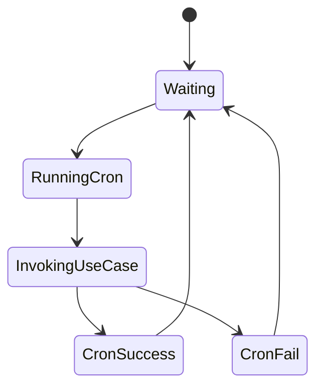

# Cronjob Container

An alternative to Celery Beat is a dedicated cronjob container.

## Responsibilities

* Execute scheduled commands at fixed intervals
* Trigger application use cases via management commands

## State Diagram

## Notes

* Suitable for simple periodic tasks
* Each cronjob must call application use cases
* Should not contain business logic
