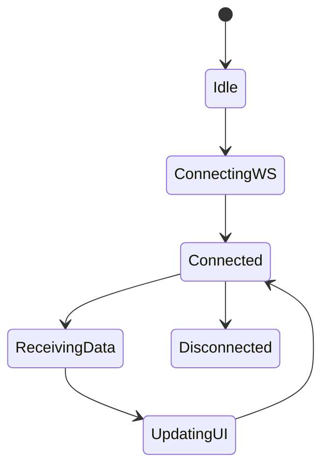

# Frontend Realtime Flow

The frontend is a React-based dashboard that consumes real-time updates via WebSocket.

## Responsibilities

* Establish WebSocket connection
* Receive telemetry and device updates
* Update UI state accordingly

## State Diagram

## Notes

* The frontend should not poll APIs for realtime data
* State management should handle streaming updates efficiently
