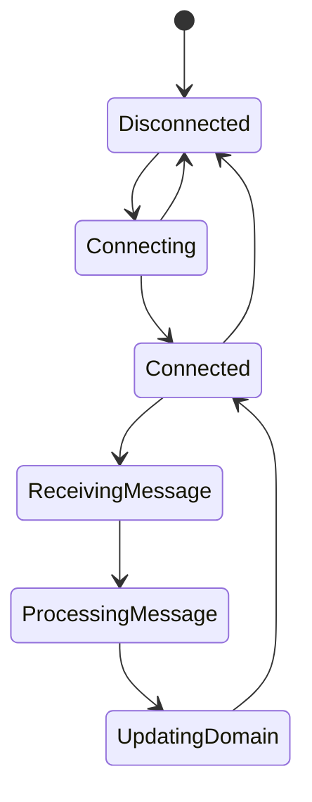

# MQTT Worker

The MQTT Worker is responsible for consuming messages from the MQTT broker and delegating processing to application use cases.

## Responsibilities

* Maintain connection to MQTT broker
* Subscribe to telemetry and command topics
* Parse incoming messages
* Invoke application use cases
* Handle reconnection and Last Will and Testament (LWT)

## State Diagram

## Notes

* The MQTT Worker runs in a dedicated container.
* It must not contain business logic.
* It should delegate all operations to the application layer.
