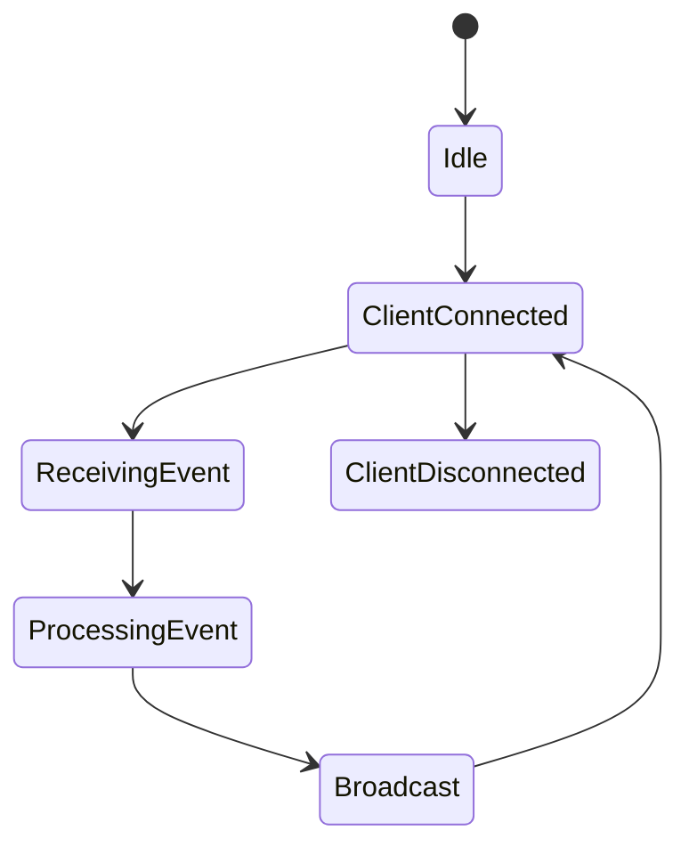

# WebSocket and Channels

Django Channels is used to provide real-time communication between the backend and frontend.

## Responsibilities

* Manage WebSocket connections
* Subscribe clients to groups
* Receive events from Redis channel layer
* Broadcast updates to connected clients

## State Diagram

## Notes

* Redis is used as the channel layer backend.
* WebSocket consumers should remain lightweight.
* Business logic must not be implemented inside consumers.
